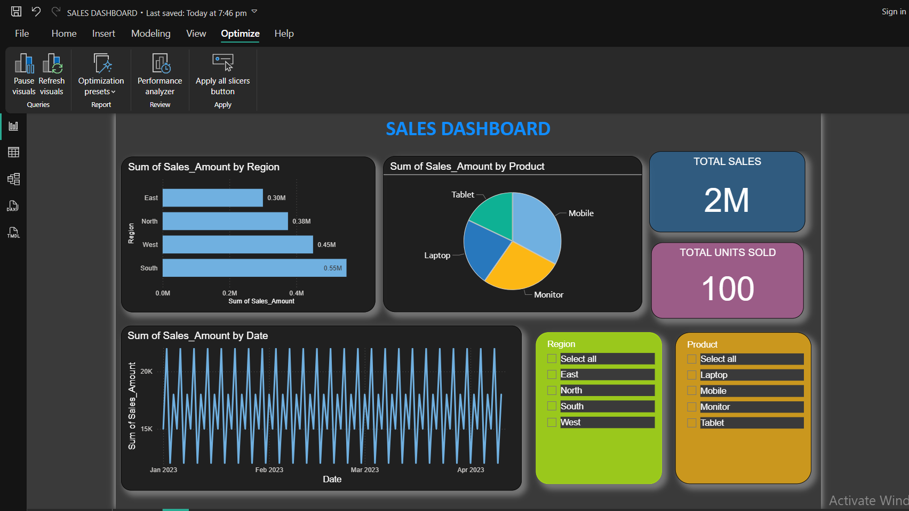

# 📊 Sales Dashboard - Power BI

## 📝 Project Overview
This project features a professional Sales Dashboard built using Power BI. It showcases interactive visualizations to analyze sales performance across regions and product categories.

## 🔧 Tools Used
- Power BI Desktop
- Sample sales dataset (Excel)
- Visuals: Bar charts, Line charts, Pie chart, KPIs, Slicers

## 📈 Features
- Total Sales and Units Sold KPIs
- Interactive Slicers for Region and Product
- Time-series Sales Trend (Line Chart)
- Sales by Product (Pie Chart)
- Regional Performance Analysis (Bar Charts)

## 📸 Dashboard Preview

## 📁 Project Files
- `Sales_Dashboard.pbix`: Power BI dashboard file
- `dashboard.png`: Screenshot of the dashboard
- `Sample_Sales_Data_For_PowerBI.xlsx`: Dataset used

## 👩‍💻 About Me
I'm **Pavani Nagu**, an aspiring Data Analyst skilled in:
- Excel, Power BI, Tableau, Python
- Data Cleaning, Visualization, and Dashboard Creation

This dashboard project reflects my hands-on ability to derive insights from raw data and build clean, interactive business visuals.

## 🔗 Connect with Me
- 📧 Email: pavaninagu28@gmail.com
- 🧑‍💻 GitHub: [pavani-nagu](https://github.com/pavani-nagu)
